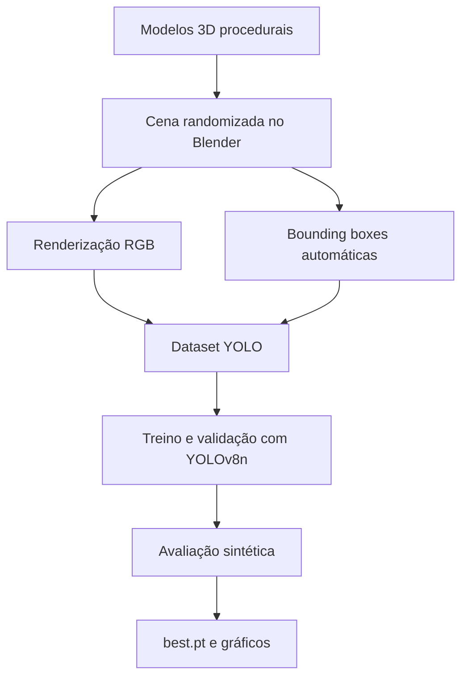

# Detecção de materiais escolares com dados sintéticos

Pipeline completo para geração de imagens sintéticas no Blender, anotação automática no formato YOLO e treinamento de um modelo YOLOv8n capaz de detectar **lápis**, **borrachas** e **apontadores**.

O projeto foi desenvolvido como trabalho final do Fastcamp de Dados Sintéticos para integrar modelagem 3D, automação com Python, randomização de domínio, organização de datasets e treinamento de redes neurais para visão computacional.

## Resultados principais

O melhor modelo foi avaliado no conjunto sintético de teste disponível durante a execução.

| Classe | Precisão | Recall | mAP@50 | mAP@50-95 |
|---|---:|---:|---:|---:|
| Lápis | 0,996 | 1,000 | 0,995 | 0,765 |
| Borracha | 0,984 | 1,000 | 0,995 | 0,995 |
| Apontador | 0,984 | 1,000 | 0,995 | 0,995 |
| **Global** | **0,9879** | **1,0000** | **0,9950** | **0,9183** |

O teste utilizou **17 imagens e 41 instâncias**. O desempenho elevado confirma o funcionamento do pipeline dentro do domínio sintético. O mAP@50-95 inferior do lápis indica maior dificuldade para ajustar caixas precisas ao seu formato longo e estreito.

> **Atenção sobre o split:** o planejamento inicial previa 600 imagens, divididas em 420 para treino, 90 para validação e 90 para teste. Na execução registrada, foram encontrados 420 arquivos de treino, 90 de validação e 17 de teste, totalizando 527 imagens. Para concluir exatamente o split 70/15/15, devem ser adicionadas as 73 imagens de teste restantes e executada novamente apenas a avaliação final com `split="test"`.

## Objetivo

Desenvolver um detector de objetos treinado exclusivamente com imagens sintéticas. Dada uma imagem de uma cena contendo materiais escolares, o modelo deve:

- localizar cada objeto por meio de uma caixa delimitadora;
- atribuir uma das classes `lapis`, `borracha` ou `apontador`;
- retornar a confiança associada a cada detecção.

## Pipeline



Em cada amostra, o script modifica posição, rotação e escala dos objetos, além da câmera, do fundo e da iluminação. Os oito cantos da caixa tridimensional de cada objeto são projetados no plano da câmera e convertidos para o formato YOLO:

```text
classe centro_x centro_y largura altura
```

Todas as coordenadas são normalizadas no intervalo de 0 a 1.

## Dataset

| Item | Configuração |
|---|---|
| Tarefa | Detecção de objetos |
| Resolução | 640 x 640 pixels |
| Classes | Lápis, borracha e apontador |
| Objetos por imagem | De 1 a 3 |
| Formato das imagens | PNG RGB |
| Anotação | Bounding boxes no formato YOLO |
| Treino executado | 420 imagens |
| Validação executada | 90 imagens e 207 instâncias |
| Teste executado | 17 imagens e 41 instâncias |

Estrutura esperada:

```text
dataset/
├── dataset.yaml
├── train/
│   ├── images/
│   └── labels/
├── valid/
│   ├── images/
│   └── labels/
└── test/
    ├── images/
    └── labels/
```

Exemplo de `dataset.yaml`:

```yaml
path: dataset
train: train/images
val: valid/images
test: test/images

names:
  0: lapis
  1: borracha
  2: apontador
```

## Tecnologias utilizadas

- Blender 4.x e API Python `bpy`;
- Python 3.12;
- Ultralytics 8.4.115;
- YOLOv8n e PyTorch 2.11;
- Google Colab com GPU Tesla T4;
- OpenCV, Pillow, Matplotlib e PyYAML.

## Configuração do treinamento

| Hiperparâmetro | Valor |
|---|---:|
| Modelo inicial | `yolov8n.pt` |
| Épocas | 80 |
| Tamanho da imagem | 640 |
| Batch | 16 |
| Paciência | 20 épocas |
| Semente | 42 |
| Otimizador | Automático |
| Transferência de aprendizado | Ativada |
| Hardware | Tesla T4, 14.913 MiB |
| Duração | Aproximadamente 16,8 minutos |

O modelo final possui aproximadamente **3,0 milhões de parâmetros** e **8,1 GFLOPs**. O checkpoint selecionado foi o `best.pt`, correspondente ao melhor desempenho observado na validação.

## Estrutura do repositório

```text
Aula 12 - Trabalho Final/
├── blender/
│   ├── gerar_dataset_escolar.py
│   └── cena_materiais_escolares.blend
├── dataset/
│   ├── manifesto.csv
│   ├── train/
│   ├── valid/
│   └── test/
├── resultados/
│   ├── deteccao_escolar/
│   ├── avaliacao_teste/
│   └── demonstracao_deteccao/
│   └── metricas_teste.json
├── treinamento/
│   ├── treinamento.ipynb
│   └── best.pt
├── README.md
└── relatorio_projeto_final.pdf
```

## Como gerar o dataset

### Pela interface do Blender

1. Abra o Blender.
2. Acesse **Scripting**.
3. Abra `blender/gerar_dataset_escolar.py`.
4. Clique em **Run Script**.
5. Aguarde a criação das imagens, rótulos e do arquivo `.blend`.

### Pela linha de comando

```bash
blender --background --python blender/gerar_dataset_escolar.py
```

O script cria proceduralmente os três objetos, configura a cena, gera as imagens e salva as anotações correspondentes. Para testar o pipeline antes da geração completa, reduza temporariamente `TOTAL_IMAGENS` no início do script.

## Como validar o dataset

Instale as dependências:

```bash
python -m pip install -r requirements.txt
```

Execute a validação estrutural:

```bash
python scripts/validar_dataset.py --dataset dataset
```

O validador confere:

- correspondência entre imagens e arquivos `.txt`;
- IDs das classes;
- coordenadas normalizadas;
- caixas com largura ou altura inválida;
- resolução das imagens;
- distribuição de instâncias entre os conjuntos.

Para desenhar as caixas verdadeiras em nove amostras:

```bash
python scripts/visualizar_anotacoes.py --dataset dataset --quantidade 9
```

## Como treinar

### Google Colab

1. Envie o dataset ao Google Drive.
2. Abra `treinamento/treinamento.ipynb` no Google Colab.
3. Ative uma GPU em **Ambiente de execução > Alterar o tipo de ambiente de execução**.
4. Ajuste `PROJECT_DIR` para a pasta do dataset.
5. Execute as células em ordem.

O núcleo do treinamento é:

```python
from ultralytics import YOLO

model = YOLO("yolov8n.pt")

model.train(
    data="dataset/dataset.yaml",
    epochs=80,
    imgsz=640,
    batch=16,
    patience=20,
    seed=42,
    pretrained=True,
    device=0,
    plots=True
)
```

### Script Python

```bash
python treinamento/treinar_yolov8.py \
  --data dataset/dataset.yaml \
  --epochs 80 \
  --batch 16 \
  --device 0
```

## Avaliação

O melhor checkpoint deve ser avaliado no conjunto de teste:

```python
from ultralytics import YOLO

model = YOLO("models/best.pt")

metrics = model.val(
    data="dataset/dataset.yaml",
    split="test",
    imgsz=640,
    batch=16,
    device=0,
    plots=True
)

print("Precisão:", metrics.box.mp)
print("Recall:", metrics.box.mr)
print("mAP@50:", metrics.box.map50)
print("mAP@50-95:", metrics.box.map)
```

## Executar inferência

### Em uma imagem

```python
from ultralytics import YOLO

model = YOLO("models/best.pt")
model.predict(
    source="imagem.png",
    conf=0.25,
    imgsz=640,
    save=True
)
```

### Pela linha de comando

```bash
yolo detect predict \
  model=models/best.pt \
  source=imagem.png \
  conf=0.25 \
  imgsz=640 \
  save=True
```

## Interpretação dos resultados

O recall igual a 1,0 indica que todas as instâncias do conjunto de teste foram detectadas no limiar utilizado. O mAP@50 de 0,995 demonstra excelente separação entre as três classes dentro do ambiente sintético. Já o mAP@50-95 global de 0,9183 mostra que a precisão espacial das caixas diminui quando são utilizados limiares de IoU mais rigorosos.

O lápis apresentou mAP@50-95 de 0,765, enquanto borracha e apontador alcançaram aproximadamente 0,995. A diferença é coerente com a geometria do lápis: pequenas variações nas extremidades de uma caixa longa e estreita provocam redução maior de IoU do que em objetos compactos.

## Limitações

- O teste executado possui somente 17 imagens, menos que as 90 planejadas.
- Treino, validação e teste foram produzidos pelo mesmo pipeline de renderização.
- Os modelos 3D e materiais são simplificados.
- O modelo ainda não foi avaliado sistematicamente com fotografias reais.
- Resultados sintéticos elevados não comprovam desempenho equivalente no mundo real.

Essas diferenças caracterizam o **domain gap**. Como trabalhos futuros, recomenda-se completar o conjunto de teste, avaliar fotografias reais, inserir texturas mais variadas, ruído de câmera, desfoque, oclusões e objetos distratores e, se necessário, realizar ajuste fino com uma pequena quantidade de dados reais anotados.

## Artefatos produzidos

- script de geração e anotação automática;
- cena configurada do Blender;
- dataset no formato YOLO;
- notebook de treinamento executado;
- curvas de treinamento;
- matrizes de confusão;
- predições qualitativas;
- checkpoint treinado `best.pt`;
- relatório técnico.

## Referências

- [Blender Python API](https://docs.blender.org/api/current/)
- [Projeção de coordenadas no Blender](https://docs.blender.org/api/current/bpy_extras.object_utils.html)
- [Ultralytics: formato de datasets de detecção](https://docs.ultralytics.com/datasets/detect/)
- [Ultralytics: treinamento](https://docs.ultralytics.com/modes/train/)
- [Ultralytics: validação](https://docs.ultralytics.com/modes/val/)

## Autora

**Ana Clara Fortunato de Souza**  
Engenharia de Computação - Universidade Federal de Goiás

